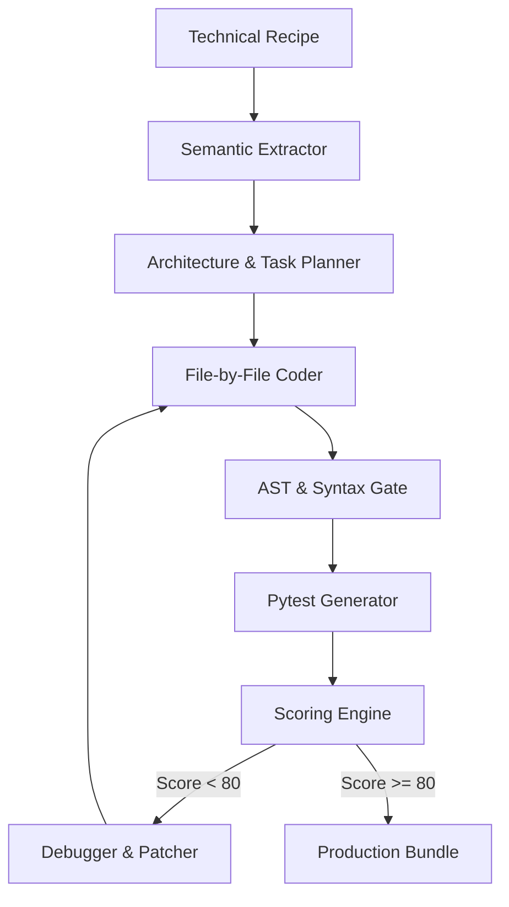

# Agent Generation Engine (v5 Professional)

A production-grade, self-correcting autonomous engine designed to build modular AI agents from technical recipes. This engine mimics the reliability and code quality of elite AI engineering systems like Claude Code.

## 🚀 Key Features

*   **13-Step Autonomous Pipeline**: From raw document extraction to final production-grade deployment.
*   **Deterministic Architecture Planning**: Strictly separates business logic, data models, and external services.
*   **Self-Correcting Code Loop**: Uses AST parsing and real-time test feedback to debug and patch its own code.
*   **Modular "Claude-Native" Output**: Generates code with structured logging, Pydantic validation, and comprehensive documentation.
*   **Quantitative Scoring**: Audits every generation across Functional, Robustness, Security, and Readability metrics.

## 🛠️ Engine Architecture



## 📦 Project Structure

```text
.
├── agents/            # Core AI Agents (Planner, Coder, Tester)
├── api/               # Document Extraction and Intake
├── core/              # Scoring and Patching Logic
├── tools/             # File-system and Command-line Tools
├── models/            # Pydantic Schemas for the Engine
├── output/            # Generated Agent Bundles (Git Ignored)
├── config.py          # Engine Configuration
└── main.py            # CLI / Entry point
```

## 🛠️ Getting Started

1. **Clone the repository**:
   ```bash
   git clone https://github.com/lokesh-unnam/centralized-agent-dev
   cd centralized-agent-dev
   ```

2. **Install dependencies**:
   ```bash
   pip install -r requirements.txt
   ```

3. **Configure Environment**:
   Create a `.env` file based on `.env.example`:
   ```text
   OPENAI_API_KEY=your_key_here
   ```

4. **Run a Generation**:
   ```bash
   python scratch/run_v5_orchestrator.py
   ```

## 📜 License
MIT
